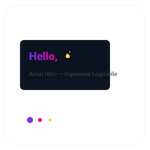

<!-- README.md -->
<h1 align="center">
  
   
  <strong>Amal Hkiri</strong>
</h1>

  <a href="mailto:amal.hkiri@esprit.tn">✉️ amal.hkiri@esprit.tn</a> · Tunis, Tunisie · +216 93 843 946

  
  
  
  ?style=for-the-badge" alt="langues"/>

---

## 👋 Bonjour ! (Quick intro)
Je suis **Amal Hkiri**, étudiante en ingénierie logicielle (ESPRIT). J’aime construire des projets full-stack, explorer les architectures microservices et automatiser les déploiements avec Docker.  
Je recherche un **stage d’été (2 mois)** pour mettre en pratique mes compétences et apprendre au contact d’équipes pro.

---

## 🔭 Projets & Technologies
**Languages & frameworks:** C, C++, Java, PHP, Python, JavaScript, SQL — Angular, Symfony, Spring Boot, JavaFX.  
**Databases / DevOps:** MySQL, MongoDB, Docker.  
**Conception:** REST APIs, Microservices.  
**Versioning:** Git / GitHub.

---

## 📂 Projets académiques (highlights)
- **Jeu 2D (C, SDL)** — plateforme sous Ubuntu.  
- **Gestion agences d’ambulances (C++, Qt)** — gestion des ressources et planning.  
- **Site gestion restaurants (HTML/CSS/JS, Symfony/PHP)**.  
- **Application e-learning (Spring Boot + Angular)** — back-end robuste + front modulaire.

---

## 🧾 Expériences
- **Actia (Tunis)** — Stage Développement Logiciel (Juil.–Août 2024) — frontend & backend pour un site web.  
- **Total Energy (Tunis)** — Stage d’Initiation (Été 2022) — observation & participation RH/admin.

---

## ✨ Aperçu visuel / démo
- Ouvre `profile.html` dans ton navigateur pour voir une **mini-page animée "Hello World"** (design moderne, animation CSS, bouton contact).
- Le même `hello.svg` est utilisé en en-tête du README pour une touche visuelle.

---

## 📫 Contact
Email: amal.hkiri@esprit.tn  
Téléphone: +216 93 843 946  
LinkedIn / GitHub: *(ajoute tes liens)*

---

## 💡 Conseils pour améliorer ce repo
1. Ajoute des badges dynamiques (réputation GitHub, top languages).  
2. Héberge `profile.html` via **GitHub Pages** pour une démo en ligne.  
3. Ajoute captures/ GIFs des projets (screenshots + mini vidéos) dans `assets/`.

---

> Merci d’avoir regardé ! Si tu veux, je peux aussi:
> - transformer ce README pour GitHub Pages (index.html),
> - générer des badges personnalisés,
> - ou créer une version en anglais.

